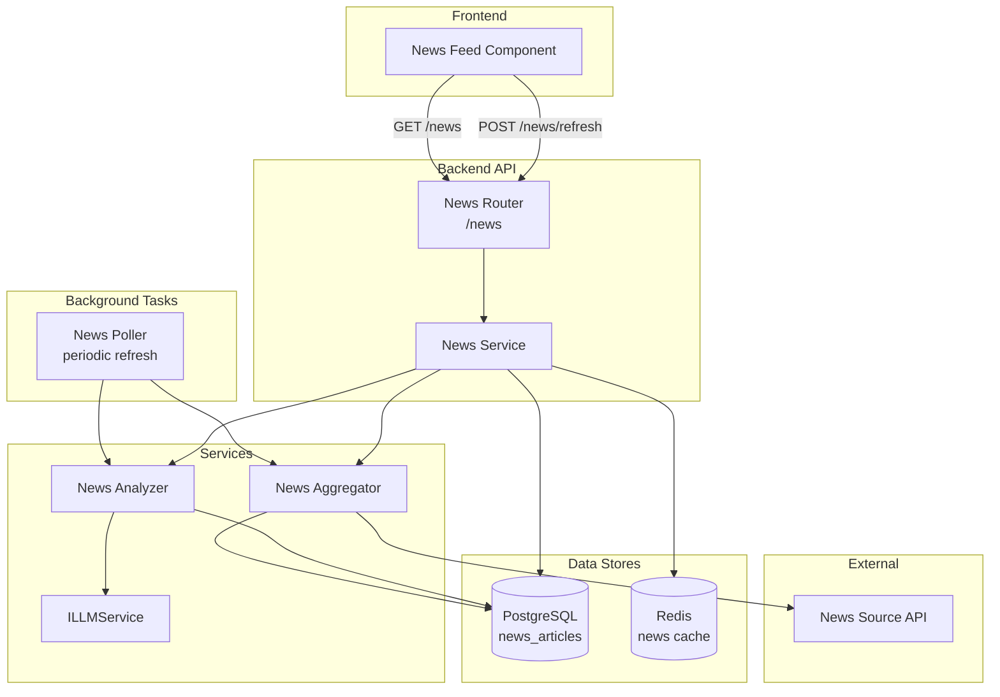

# Design Document: Market News Analysis

## Overview

The Market News Analysis feature adds an LLM-powered news aggregation and analysis pipeline to the Stock Investment Dashboard. It fetches financial news relevant to Indian equity markets (NSE/BSE), analyzes each article for sentiment and impact using the existing LLM service infrastructure, and surfaces results through a dedicated News Feed in the frontend dashboard.

The system operates in three stages:
1. **Fetch** — A News Aggregator service retrieves articles from configured external news APIs, filtering for Indian market relevance.
2. **Analyze** — A News Analyzer processes each article through the LLM provider (or stub) to extract sentiment, impact level, related tickers, and a short summary.
3. **Serve & Display** — A REST API endpoint exposes analyzed news, and a React-based News Feed component renders it with filtering and sorting.

Key design decisions:
- **Reuse existing `ILLMService` interface** by adding a new method rather than creating a separate LLM integration. This preserves provider switching without news-specific config.
- **Store analyzed articles in PostgreSQL** for persistence and paginated querying; use Redis for caching the latest feed and tracking refresh state.
- **Background task pattern** mirrors the existing `price_poller` for periodic refresh, with a manual trigger exposed via the API.
- **Stub-first design** ensures the feature works in development without LLM credentials.

## Architecture



The data flow for a refresh cycle:
1. News Poller (or manual trigger) invokes the News Aggregator to fetch raw articles.
2. News Aggregator fetches from external API(s), filters for relevance, and stores raw articles in PostgreSQL.
3. News Poller then invokes the News Analyzer on unanalyzed articles.
4. News Analyzer calls the LLM service for each article, stores sentiment/impact/summary back to the database.
5. News Service reads from the database and Redis cache to serve the API endpoint.

## Components and Interfaces

### Backend Components

#### 1. `INewsService` (Interface)
Located at `backend/interfaces/news_service.py`. Defines the contract for fetching, refreshing, and querying analyzed news.

```python
class INewsService(ABC):
    async def get_news_feed(
        self,
        user_id: UUID,
        sentiment: str | None = None,
        impact_level: str | None = None,
        ticker: str | None = None,
        page: int = 1,
        page_size: int = 20,
    ) -> PaginatedNewsResponse: ...

    async def trigger_refresh(self, user_id: UUID) -> RefreshStatus: ...
```

#### 2. `NewsAggregator`
Located at `backend/services/news_aggregator.py`. Responsible for:
- Fetching articles from configured News Source APIs (NewsAPI or equivalent)
- Filtering articles for Indian market relevance (NSE/BSE tickers, India macro, portfolio sectors)
- Persisting raw articles to the database
- Handling API failures gracefully (log and continue)

```python
class NewsAggregator:
    async def fetch_articles(self, portfolio_tickers: list[str]) -> list[RawNewsArticle]: ...
    async def store_articles(self, articles: list[RawNewsArticle]) -> int: ...
```

#### 3. `NewsAnalyzer`
Located at `backend/services/news_analyzer.py`. Responsible for:
- Processing raw articles through the LLM to determine sentiment, impact, related tickers, and summary
- Handling LLM errors with retry marking
- Returning deterministic stub responses when LLM is in stub mode

```python
class NewsAnalyzer:
    async def analyze_article(self, article: RawNewsArticle, portfolio_tickers: list[str]) -> AnalyzedNewsItem: ...
    async def analyze_batch(self, articles: list[RawNewsArticle], portfolio_tickers: list[str]) -> list[AnalyzedNewsItem]: ...
```

#### 4. `NewsService`
Located at `backend/services/news_service.py`. Orchestrates aggregator + analyzer, serves cached/paginated results, handles scoring and ranking.

#### 5. `news_poller` (Background Task)
Located at `backend/tasks/news_poller.py`. Periodic background task (default: every 30 minutes) that triggers fetch + analyze cycles. Follows the same pattern as `price_poller.py`.

#### 6. News Router
Located at `backend/routers/news.py`. Exposes REST endpoints:
- `GET /news` — paginated, filterable list of analyzed news items
- `POST /news/refresh` — manual refresh trigger

#### 7. `ILLMService` Extension
Add a new method to the existing interface:

```python
@abstractmethod
async def analyze_news_article(
    self,
    article_content: str,
    portfolio_tickers: list[str],
) -> NewsAnalysisResponse: ...
```

### Frontend Components

#### 1. `NewsFeed` Component
Located at `frontend/src/components/news/NewsFeed.tsx`. Main container component that:
- Displays analyzed news items in a scrollable list
- Provides filter controls (sentiment, impact, ticker)
- Shows loading skeleton during fetch
- Includes manual refresh button with loading state

#### 2. `NewsItem` Component
Located at `frontend/src/components/news/NewsItem.tsx`. Individual news card with:
- Title, source, publication time
- LLM-generated summary
- Sentiment indicator (green/red/gray)
- Impact level badge
- Expandable detail view with related tickers

#### 3. `NewsFilters` Component
Located at `frontend/src/components/news/NewsFilters.tsx`. Filter bar for sentiment, impact level, and ticker selection.

#### 4. `useNews` Hook
Located at `frontend/src/hooks/useNews.ts`. React Query hook for fetching and refreshing news data.

#### 5. API Client Extension
Located at `frontend/src/api/news.ts`. API functions for news endpoints.

## Data Models

### Database Schema (PostgreSQL)

```sql
CREATE TABLE news_articles (
    id UUID PRIMARY KEY DEFAULT gen_random_uuid(),
    user_id UUID NOT NULL REFERENCES users(id) ON DELETE CASCADE,
    title TEXT NOT NULL,
    source_name VARCHAR(100) NOT NULL,
    source_url TEXT,
    published_at TIMESTAMP WITH TIME ZONE NOT NULL,
    raw_content TEXT NOT NULL,
    summary VARCHAR(200),
    sentiment_score VARCHAR(10),  -- 'bullish', 'bearish', 'neutral'
    impact_level VARCHAR(10),    -- 'high', 'medium', 'low'
    related_tickers TEXT[],      -- array of ticker symbols
    relevance_score FLOAT DEFAULT 0.0,
    is_analyzed BOOLEAN DEFAULT FALSE,
    is_stub BOOLEAN DEFAULT FALSE,
    analyzed_at TIMESTAMP WITH TIME ZONE,
    fetched_at TIMESTAMP WITH TIME ZONE DEFAULT NOW(),
    created_at TIMESTAMP WITH TIME ZONE DEFAULT NOW()
);

CREATE INDEX idx_news_articles_user_id ON news_articles(user_id);
CREATE INDEX idx_news_articles_published_at ON news_articles(published_at DESC);
CREATE INDEX idx_news_articles_sentiment ON news_articles(sentiment_score);
CREATE INDEX idx_news_articles_impact ON news_articles(impact_level);
CREATE INDEX idx_news_articles_analyzed ON news_articles(is_analyzed);
```

### Domain Models (Pydantic)

```python
class SentimentScore(str, Enum):
    BULLISH = "bullish"
    BEARISH = "bearish"
    NEUTRAL = "neutral"

class ImpactLevel(str, Enum):
    HIGH = "high"
    MEDIUM = "medium"
    LOW = "low"

class RawNewsArticle(BaseModel):
    title: str
    source_name: str
    source_url: str | None = None
    published_at: datetime
    raw_content: str

class AnalyzedNewsItem(BaseModel):
    id: UUID
    title: str
    source_name: str
    source_url: str | None = None
    published_at: datetime
    summary: str  # max 200 chars
    sentiment_score: SentimentScore
    impact_level: ImpactLevel
    related_tickers: list[str]
    relevance_score: float
    is_stub: bool = False
    analyzed_at: datetime

class NewsAnalysisResponse(BaseModel):
    """LLM output for a single article analysis."""
    summary: str
    sentiment_score: SentimentScore
    impact_level: ImpactLevel
    related_tickers: list[str]
    is_stub: bool = False

class PaginatedNewsResponse(BaseModel):
    items: list[AnalyzedNewsItem]
    total: int
    page: int
    page_size: int
    has_next: bool

class RefreshStatus(BaseModel):
    status: Literal["started", "in_progress", "completed", "failed"]
    articles_fetched: int = 0
    articles_analyzed: int = 0
    last_refresh_at: datetime | None = None
```

### Redis Cache Structure

| Key Pattern | Type | TTL | Purpose |
|---|---|---|---|
| `news:feed:{user_id}:page:{n}` | JSON string | 5 min | Cached paginated feed response |
| `news:refresh:{user_id}` | Hash | 10 min | Refresh status tracking |
| `news:last_refresh:{user_id}` | String (ISO timestamp) | None | Last successful refresh time |

### ORM Model

```python
class NewsArticle(Base):
    __tablename__ = "news_articles"

    id: Mapped[UUID] = mapped_column(PGUUID(as_uuid=True), primary_key=True, default=uuid4)
    user_id: Mapped[UUID] = mapped_column(PGUUID(as_uuid=True), ForeignKey("users.id", ondelete="CASCADE"))
    title: Mapped[str] = mapped_column(Text, nullable=False)
    source_name: Mapped[str] = mapped_column(String(100), nullable=False)
    source_url: Mapped[str | None] = mapped_column(Text, nullable=True)
    published_at: Mapped[datetime] = mapped_column(sa.TIMESTAMP(timezone=True), nullable=False)
    raw_content: Mapped[str] = mapped_column(Text, nullable=False)
    summary: Mapped[str | None] = mapped_column(String(200), nullable=True)
    sentiment_score: Mapped[str | None] = mapped_column(String(10), nullable=True)
    impact_level: Mapped[str | None] = mapped_column(String(10), nullable=True)
    related_tickers: Mapped[list[str] | None] = mapped_column(ARRAY(String), nullable=True)
    relevance_score: Mapped[float] = mapped_column(sa.Float, default=0.0)
    is_analyzed: Mapped[bool] = mapped_column(sa.Boolean, default=False)
    is_stub: Mapped[bool] = mapped_column(sa.Boolean, default=False)
    analyzed_at: Mapped[datetime | None] = mapped_column(sa.TIMESTAMP(timezone=True), nullable=True)
    fetched_at: Mapped[datetime] = mapped_column(sa.TIMESTAMP(timezone=True), server_default=sa.func.now())
    created_at: Mapped[datetime] = mapped_column(sa.TIMESTAMP(timezone=True), server_default=sa.func.now())

    user: Mapped["User"] = relationship(back_populates="news_articles")
```

## Correctness Properties

*A property is a characteristic or behavior that should hold true across all valid executions of a system — essentially, a formal statement about what the system should do. Properties serve as the bridge between human-readable specifications and machine-verifiable correctness guarantees.*

### Property 1: Article relevance filtering

*For any* set of raw articles and a user's portfolio tickers, the relevance filter SHALL return only articles whose content contains at least one reference to an NSE/BSE ticker, Indian market keyword, or a sector matching the portfolio tickers — articles with no such reference SHALL be excluded.

**Validates: Requirements 1.2**

### Property 2: Article storage round-trip

*For any* valid raw news article (with title, source name, publication timestamp, and content), storing it in the database and then retrieving it SHALL yield an article with identical title, source_name, published_at, and raw_content fields.

**Validates: Requirements 1.4**

### Property 3: Time window filtering

*For any* article with a publication timestamp, the time filter SHALL include it if and only if the timestamp is within the last 24 hours relative to the fetch time — articles older than 24 hours SHALL be excluded.

**Validates: Requirements 1.5**

### Property 4: Summary length invariant

*For any* analyzed news article, the generated summary field SHALL have a length of at most 200 characters.

**Validates: Requirements 2.3**

### Property 5: Portfolio relevance scoring

*For any* two articles where one mentions at least one of the user's portfolio tickers and the other mentions none, the article mentioning a portfolio ticker SHALL receive a strictly higher relevance score.

**Validates: Requirements 3.1**

### Property 6: Sentiment and impact domain constraints

*For any* analyzed news article, the sentiment_score SHALL be one of {"bullish", "bearish", "neutral"} AND the impact_level SHALL be one of {"high", "medium", "low"}.

**Validates: Requirements 3.2, 3.3**

### Property 7: Multi-ticker association

*For any* article whose content mentions N distinct portfolio tickers (where N ≥ 1), the related_tickers field in the analysis output SHALL contain all N mentioned tickers.

**Validates: Requirements 3.4, 2.2**

### Property 8: Ranking invariant

*For any* list of analyzed news articles, after applying the ranking function, every article with impact_level "high" and positive portfolio relevance SHALL appear before any article with impact_level "low" or zero portfolio relevance.

**Validates: Requirements 3.5**

### Property 9: News item rendering completeness

*For any* analyzed news item passed to the NewsItem component, the rendered output SHALL contain the title, source name, publication time, summary text, a sentiment indicator element, and an impact level indicator element.

**Validates: Requirements 4.2**

### Property 10: Frontend filter correctness

*For any* list of news items and any combination of active filters (sentiment, impact_level, ticker), the filtered output SHALL contain only items that match ALL active filter criteria — no item violating any active filter SHALL appear in the result.

**Validates: Requirements 4.5**

### Property 11: Pagination correctness

*For any* total list of N analyzed articles, requesting page P with page_size S SHALL return at most S items, the items SHALL correspond to the correct slice (offset = (P-1)*S), and has_next SHALL be true if and only if there are more items beyond the current page.

**Validates: Requirements 6.1**

### Property 12: API filter correctness

*For any* set of analyzed news articles in the database and any combination of query parameters (sentiment_score, impact_level, ticker), the API response SHALL contain only articles matching all specified filter criteria.

**Validates: Requirements 6.2**

### Property 13: Response schema completeness

*For any* news item returned by the GET /news endpoint, the JSON object SHALL contain all required fields: id, title, source, published_at, summary, sentiment_score, impact_level, related_tickers, and analyzed_at — none of these fields SHALL be null.

**Validates: Requirements 6.3**

### Property 14: Stub determinism

*For any* article content, when the LLM provider is set to "stub", invoking the analysis function twice with the same input SHALL produce identical output (same summary, sentiment_score, impact_level, and related_tickers).

**Validates: Requirements 7.3**

## Error Handling

### Backend Error Handling

| Error Scenario | Handling Strategy | User Impact |
|---|---|---|
| News Source API unreachable | Log error, continue with remaining sources. Store partial results. | May see fewer articles; no crash |
| News Source API rate limited | Back off with exponential retry (max 3 attempts). Log warning. | Delayed refresh |
| LLM provider unavailable | Mark article as `is_analyzed=false`, retry on next cycle | Articles appear without analysis until retry succeeds |
| LLM returns malformed response | Log error, mark article as unanalyzed, continue with next article | Graceful degradation |
| Database write failure | Raise exception, propagate 500 to API caller, log with full context | Refresh reported as failed |
| Redis unavailable | Fall back to direct DB queries (slower but functional) | Slightly slower response times |
| User not authenticated | Return 401 immediately | Must log in to access news |
| Invalid filter parameters | Return 422 with validation error details | Clear error message |

### Frontend Error Handling

| Error Scenario | UI Behavior |
|---|---|
| Network error on news fetch | Show last cached data with stale indicator |
| Refresh timeout (>30s) | Show error toast, keep existing data visible |
| Empty news feed | Show empty state message ("No analyzed news available") |
| Partial data (some items missing fields) | Render available fields, hide missing indicators |

### Retry Strategy

- **News Source API**: Exponential backoff — 1s, 2s, 4s — max 3 retries per source per cycle
- **LLM Analysis**: No immediate retry; articles are re-attempted on the next scheduled analysis cycle (30 min)
- **Redis Cache Miss**: No retry needed; fall back to DB read

## Testing Strategy

### Property-Based Tests (Hypothesis)

The project already uses `hypothesis==6.112.2` (declared in pyproject.toml dev dependencies). Each correctness property maps to a single property-based test with minimum 100 iterations.

**Library**: Hypothesis (Python)
**Configuration**: `@settings(max_examples=100)`
**Tag format**: `# Feature: market-news-analysis, Property {N}: {title}`

Property tests target:
- Relevance filtering logic (Property 1)
- Article storage round-trip (Property 2)
- Time window filtering (Property 3)
- Summary truncation/constraint (Property 4)
- Relevance scoring comparisons (Property 5)
- Domain enum constraints (Property 6)
- Ticker extraction completeness (Property 7)
- Ranking sort order (Property 8)
- Pagination slicing and metadata (Property 11)
- API-level filtering (Property 12)
- Response schema field presence (Property 13)
- Stub determinism (Property 14)

Frontend properties (9, 10) use `fast-check` with React Testing Library if unit test framework is added, otherwise covered by Playwright example-based tests.

### Unit Tests (pytest)

Focus on specific examples and edge cases:
- Empty article list handling (6.5)
- Authentication failure returns 401 (6.4)
- Stub mode returns is_stub=true (2.5)
- LLM failure marks article unanalyzed (2.4)
- News source API failure logging (1.3)
- Sentiment indicator color mapping (4.3)
- Expand/collapse interaction (4.4)
- Loading skeleton display (4.6)
- Refresh button loading state (5.3)
- Stale data indicator on failure (5.5)

### Integration Tests

- End-to-end refresh cycle with mocked news API and stub LLM
- News poller background task scheduling verification
- Provider switching (stub → openai config) without errors
- Database migration creates correct schema
- Redis cache invalidation on refresh

### Test Organization

```
backend/tests/
  test_news_properties.py     # All property-based tests (Properties 1-8, 11-14)
  test_news_service.py        # Unit tests for NewsService
  test_news_aggregator.py     # Unit tests for NewsAggregator
  test_news_analyzer.py       # Unit tests for NewsAnalyzer
  test_news_router.py         # API endpoint integration tests
frontend/
  src/__tests__/
    NewsFeed.test.tsx          # Component example tests (Properties 9-10 if fast-check added)
```
