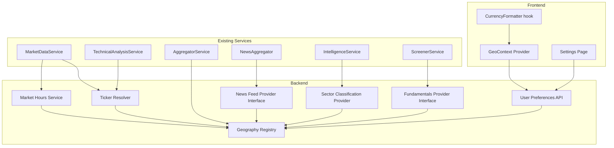

# Design Document: Multi-Geography Broker Support

## Overview

This feature abstracts all geography-specific behavior (ticker suffixes, currency, market hours, fundamentals sources, news feeds, sector maps) behind provider interfaces and a central Geography Registry. The system threads a geography context—derived from user preferences—through existing services so that Indian users experience zero change while US (and future) users get correct locale-specific behavior.

**Key design principles:**
- Registry-driven: all geography config lives in a single Python module of frozen dataclasses.
- User-scoped: geography flows from a new `user_preferences` DB row through FastAPI dependency injection.
- Interface-first: fundamentals and news providers implement abstract interfaces; new geos only add implementations.
- Backward compatible: every geography-dependent path defaults to "IN" when no preference is set.

---

## Architecture



---

## Components and Interfaces

### 1. Geography Registry (`backend/geo/registry.py`)

A pure Python module with frozen dataclasses. No DB, no I/O—just static config loaded at import time.

```python
from dataclasses import dataclass, field
from typing import Literal

GeoId = Literal["IN", "US"]

@dataclass(frozen=True)
class GeographyConfig:
    geo_id: GeoId
    currency_code: str            # "INR", "USD"
    currency_symbol: str          # "₹", "$"
    currency_locale: str          # "en-IN", "en-US"
    decimal_places: int           # 2
    exchanges: list[str]          # ["NSE","BSE"] or ["NYSE","NASDAQ"]
    yfinance_suffix: str          # ".NS" or ""
    market_open: str              # "09:15" (HH:MM local)
    market_close: str             # "15:30"
    timezone: str                 # "Asia/Kolkata"
    trading_days: list[int]       # [0,1,2,3,4] (Mon-Fri)
    fundamentals_source: str      # "screener" | "yfinance"
    news_feed_ids: list[str]      # identifiers for NewsFeedProvider
    sector_map: dict[str, str]    # ticker -> sector
    dividend_frequency: str       # "annual" | "quarterly"

_REGISTRY: dict[GeoId, GeographyConfig] = {}

def get_geo(geo_id: GeoId) -> GeographyConfig:
    """Lookup geography config. Raises ValueError for unknown geo."""
    ...

def list_geos() -> list[GeoId]:
    """Return all registered geography identifiers."""
    ...
```

**Rationale:** A frozen dataclass registry is the simplest thing that works. No ORM, no migrations for adding geos. Adding a new geography = adding a new entry to `_REGISTRY` and implementing its providers.

### 2. User Preferences (`backend/models/orm.py` + migration)

New `user_preferences` table:

| Column | Type | Default | Notes |
|--------|------|---------|-------|
| id | UUID PK | uuid4 | |
| user_id | UUID FK → users.id | | UNIQUE |
| geography | VARCHAR(5) | "IN" | |
| default_broker | VARCHAR(20) | NULL | |
| timezone | VARCHAR(50) | NULL | Uses geo default if null |
| currency_code | VARCHAR(5) | NULL | Uses geo default if null |
| created_at | TIMESTAMPTZ | now() | |
| updated_at | TIMESTAMPTZ | now() | |

**API Endpoints:**

```
GET  /api/user/preferences → UserPreferencesResponse
PUT  /api/user/preferences → UserPreferencesResponse (body: {geography?, default_broker?, timezone?, currency_code?})
```

On geography change: invalidate Redis keys `price:*`, `holdings:{user_id}:*`, fundamentals cache for that user.

### 3. Ticker Resolver (`backend/geo/ticker_resolver.py`)

```python
def resolve(ticker: str, geo_id: GeoId, exchange: str | None = None) -> str:
    """Append the correct yfinance suffix for the geography.
    
    If exchange is provided, use its specific suffix override.
    """
    ...

def strip_suffix(resolved_ticker: str, geo_id: GeoId) -> str:
    """Strip the geography suffix to recover the raw ticker."""
    ...
```

Round-trip invariant: `strip_suffix(resolve(t, g), g) == t` for all valid `(t, g)`.

### 4. Currency Formatter

**Backend** (`backend/geo/currency.py`):
```python
def format_currency(value: Decimal, geo_id: GeoId) -> str:
    """Format a Decimal value using the geography's currency rules.
    
    Used in Telegram bot messages and API string representations.
    """
    ...
```

**Frontend** (`frontend/src/utils/currency.ts`):
```typescript
export function formatCurrency(value: number, currencyCode: string, locale: string): string {
  return new Intl.NumberFormat(locale, {
    style: "currency",
    currency: currencyCode,
    maximumFractionDigits: 2,
  }).format(value);
}
```

### 5. Market Hours Service (`backend/geo/market_hours.py`)

Replaces the hardcoded `_is_market_hours()` in `market_data_service.py`.

```python
from zoneinfo import ZoneInfo
from datetime import datetime, time as dt_time, timezone

def is_market_open(geo_id: GeoId) -> bool:
    """Determine if the exchange for the given geography is currently open."""
    ...

def get_cache_ttl(geo_id: GeoId) -> int:
    """Return 30s during market hours, 300s otherwise."""
    ...
```

### 6. Fundamentals Provider Interface (`backend/interfaces/fundamentals_provider.py`)

```python
from abc import ABC, abstractmethod

class IFundamentalsProvider(ABC):
    @abstractmethod
    async def fetch_fundamentals(self, ticker: str) -> dict | None:
        """Fetch and return standardized fundamentals dict."""
        ...

    @abstractmethod
    async def get_cached_fundamentals(self, ticker: str) -> dict | None:
        """Return stored fundamentals from DB cache."""
        ...
```

**Implementations:**
- `ScreenerFundamentalsProvider` — wraps existing `ScreenerService` (geo "IN").
- `YFinanceFundamentalsProvider` — extracts P/E, book value, dividend yield, ROE, market cap from `yfinance.Ticker(ticker).info` (geo "US").

Common return schema:
```python
{
    "ticker": str,
    "market_cap": str | None,
    "pe_ratio": str | None,
    "book_value": str | None,
    "dividend_yield": str | None,
    "roe": str | None,
    "roce": str | None,  # null for US
    "fetched_at": str,   # ISO timestamp
}
```

### 7. News Feed Provider Interface (`backend/interfaces/news_feed_provider.py`)

```python
from abc import ABC, abstractmethod
from backend.models.domain import RawNewsArticle

class INewsFeedProvider(ABC):
    @abstractmethod
    async def fetch_articles(self, portfolio_tickers: list[str]) -> list[RawNewsArticle]:
        """Fetch news articles relevant to the given tickers."""
        ...
```

**Implementations:**
- `IndianNewsFeedProvider` — existing RSS (Economic Times, LiveMint, Moneycontrol).
- `USNewsFeedProvider` — Yahoo Finance RSS, Seeking Alpha RSS, MarketWatch RSS for US stocks.

### 8. Sector Classification Provider (`backend/geo/sectors.py`)

```python
def get_sector(ticker: str, geo_id: GeoId) -> str:
    """Return sector for ticker using the geo's sector map. Falls back to 'other'."""
    ...
```

The "IN" map matches the existing `SECTOR_MAP` in `intelligence_service.py`. The "US" map covers major S&P 500 constituents (AAPL→Technology, JPM→Banking, etc.).

### 9. Broker Connector Geography Binding

Add `supported_geographies: list[GeoId]` attribute to `IBrokerConnector`:

```python
class IBrokerConnector(ABC):
    broker_id: BrokerId
    supported_geographies: list[str]  # ["IN"] or ["US"]
    ...
```

- GrowwConnector: `supported_geographies = ["IN"]`
- RobinhoodConnector: `supported_geographies = ["US"]`
- ZerodhaConnector: `supported_geographies = ["IN"]`
- FidelityConnector: `supported_geographies = ["US"]`

`AggregatorService` filters connectors by user's geography before offering broker connections.

### 10. Threading Geography Through Existing Services

**Pattern:** A new FastAPI dependency `get_user_geo(session) -> GeoId` resolves the user's geography from preferences (defaulting to "IN"). Services that need geography receive it as a parameter.

```python
# backend/dependencies.py
async def get_user_geo(session: Session = Depends(get_current_user), db: AsyncSession = Depends(get_db)) -> GeoId:
    """Resolve user's geography from preferences, default 'IN'."""
    ...
```

**MarketDataService changes:**
- `get_current_price(ticker, geo_id)` — uses `ticker_resolver.resolve()` + `market_hours.get_cache_ttl(geo_id)`.
- `get_batch_prices(tickers, geo_id)` — only uses Groww LTP path when `geo_id == "IN"`.
- `get_historical_data(ticker, range, geo_id)` — resolves ticker before yfinance call.

**TechnicalAnalysisService changes:**
- `get_technicals(ticker, geo_id)` — replaces hardcoded `.NS` with `ticker_resolver.resolve()`.

**AggregatorService changes:**
- Filters `_CONNECTORS` by `supported_geographies` containing user's geo.

**IntelligenceService changes:**
- Uses `get_sector(ticker, geo_id)` instead of hardcoded `SECTOR_MAP`.

**NewsAggregator changes:**
- Selects `INewsFeedProvider` implementation based on user's geography.

### 11. Frontend Geography Context (`frontend/src/contexts/GeoContext.tsx`)

```typescript
interface GeoContextValue {
  geography: string;       // "IN" | "US"
  currencyCode: string;    // "INR" | "USD"
  currencySymbol: string;  // "₹" | "$"
  locale: string;          // "en-IN" | "en-US"
  formatCurrency: (value: number) -> string;
  isLoading: boolean;
}
```

Fetched on login via `GET /api/user/preferences`. All components that currently hardcode "₹" or `en-IN` will consume this context instead.

### 12. Backward Compatibility Strategy

| Concern | Strategy |
|---------|----------|
| No preferences row | Default geography = "IN" |
| DB migration | Add `user_preferences` table; existing users get no row → defaults apply |
| API responses | Same shape; no fields removed; geography-specific fields are additive |
| Environment variables | No new required env vars; system works in India-only mode when unconfigured |
| Existing hardcoded `.NS` | Replaced by `ticker_resolver.resolve(ticker, geo_id)` which returns `ticker + ".NS"` when geo="IN" |
| Existing `₹` in frontend | Replaced by `formatCurrency()` which returns "₹" when currency="INR" |
| Existing IST market hours | `market_hours.is_market_open("IN")` produces identical behavior to old `_is_market_hours()` for IST |

---

## Data Models

### UserPreferences (new ORM model)

```python
class UserPreferences(Base):
    __tablename__ = "user_preferences"
    __table_args__ = (UniqueConstraint("user_id", name="uq_user_preferences_user"),)

    id: Mapped[UUID] = mapped_column(PGUUID(as_uuid=True), primary_key=True, default=uuid4)
    user_id: Mapped[UUID] = mapped_column(
        PGUUID(as_uuid=True), ForeignKey("users.id", ondelete="CASCADE"), nullable=False
    )
    geography: Mapped[str] = mapped_column(String(5), default="IN", nullable=False)
    default_broker: Mapped[str | None] = mapped_column(String(20), nullable=True)
    timezone: Mapped[str | None] = mapped_column(String(50), nullable=True)
    currency_code: Mapped[str | None] = mapped_column(String(5), nullable=True)
    created_at: Mapped[datetime] = mapped_column(
        sa.TIMESTAMP(timezone=True), server_default=sa.func.now()
    )
    updated_at: Mapped[datetime] = mapped_column(
        sa.TIMESTAMP(timezone=True), server_default=sa.func.now(), onupdate=sa.func.now()
    )
```

### Alembic Migration (0011)

```python
def upgrade():
    op.create_table(
        "user_preferences",
        sa.Column("id", PGUUID(as_uuid=True), primary_key=True),
        sa.Column("user_id", PGUUID(as_uuid=True), sa.ForeignKey("users.id", ondelete="CASCADE"), nullable=False),
        sa.Column("geography", sa.String(5), server_default="IN", nullable=False),
        sa.Column("default_broker", sa.String(20), nullable=True),
        sa.Column("timezone", sa.String(50), nullable=True),
        sa.Column("currency_code", sa.String(5), nullable=True),
        sa.Column("created_at", sa.TIMESTAMP(timezone=True), server_default=sa.func.now()),
        sa.Column("updated_at", sa.TIMESTAMP(timezone=True), server_default=sa.func.now()),
        sa.UniqueConstraint("user_id", name="uq_user_preferences_user"),
    )
```

### API Schemas

```python
class UserPreferencesResponse(BaseModel):
    geography: str = "IN"
    default_broker: str | None = None
    timezone: str | None = None
    currency_code: str | None = None
    # Resolved from registry for convenience:
    currency_symbol: str = "₹"
    locale: str = "en-IN"
    exchanges: list[str] = ["NSE", "BSE"]
    supported_brokers: list[str] = []

class UpdatePreferencesRequest(BaseModel):
    geography: str | None = None
    default_broker: str | None = None
    timezone: str | None = None
    currency_code: str | None = None
```

---


## Correctness Properties

*A property is a characteristic or behavior that should hold true across all valid executions of a system—essentially, a formal statement about what the system should do. Properties serve as the bridge between human-readable specifications and machine-verifiable correctness guarantees.*

### Property 1: Geography Registry Completeness

*For any* registered geography identifier, looking it up in the Geography Registry SHALL return a config object where all required fields (currency_code, currency_symbol, currency_locale, decimal_places, exchanges, yfinance_suffix, market_open, market_close, timezone, trading_days, fundamentals_source, news_feed_ids, sector_map, dividend_frequency) are present and non-None.

**Validates: Requirements 1.1**

### Property 2: Invalid Geography Raises Error

*For any* string that is not a registered geography identifier, calling `get_geo()` SHALL raise a `ValueError` with a message containing the invalid identifier.

**Validates: Requirements 1.4**

### Property 3: User Preferences Round-Trip

*For any* valid user preferences (geography ∈ registered geos, default_broker ∈ valid broker IDs or None, timezone as valid IANA string or None, currency_code as valid ISO 4217 code or None), storing the preferences and then retrieving them SHALL produce values equal to the original input.

**Validates: Requirements 2.1**

### Property 4: Invalid Geography API Rejection

*For any* geography string that is not registered in the Geography Registry, a PUT request to `/api/user/preferences` with that geography SHALL return HTTP 400 status code.

**Validates: Requirements 2.6**

### Property 5: Ticker Resolution Appends Correct Suffix

*For any* non-empty alphanumeric ticker string and any registered geography, `resolve(ticker, geo_id)` SHALL return a string equal to `ticker + geo.yfinance_suffix`.

**Validates: Requirements 3.1, 3.2, 3.3**

### Property 6: Ticker Resolution Round-Trip

*For any* non-empty alphanumeric ticker string and any registered geography, `strip_suffix(resolve(ticker, geo_id), geo_id)` SHALL equal the original ticker.

**Validates: Requirements 3.5**

### Property 7: Currency Format Round-Trip

*For any* non-negative numeric value (up to 2 decimal places) and any registered geography, formatting the value with `format_currency` and then parsing the numeric portion from the result SHALL produce a value within 0.01 of the original.

**Validates: Requirements 4.6**

### Property 8: Market Hours Determination Correctness

*For any* registered geography and any UTC datetime: if the datetime falls within the geography's configured trading hours (market_open ≤ local_time ≤ market_close) on a configured trading day, `is_market_open(geo_id)` SHALL return True; otherwise it SHALL return False.

**Validates: Requirements 5.2, 5.3, 5.4, 5.5**

### Property 9: Fundamentals Schema Completeness

*For any* non-None result returned by any `IFundamentalsProvider.fetch_fundamentals()` implementation, the result dictionary SHALL contain all keys: ticker, market_cap, pe_ratio, book_value, dividend_yield, roe, roce, fetched_at — with values being either a string or None, never missing.

**Validates: Requirements 6.4, 6.5**

### Property 10: Sector Classification Correctness

*For any* ticker and registered geography: if the ticker exists in the geography's sector map, `get_sector(ticker, geo_id)` SHALL return the mapped sector string; if the ticker does not exist in the map, it SHALL return "other".

**Validates: Requirements 8.2, 8.3**

### Property 11: Broker Geography Filtering

*For any* registered geography, filtering the broker connectors by that geography SHALL return only connectors whose `supported_geographies` list contains that geography; and for any connector NOT in the filtered set, attempting to connect SHALL be rejected.

**Validates: Requirements 9.4, 9.5**

### Property 12: Groww LTP Geo Restriction

*For any* geography that is not "IN", the MarketDataService batch price fetching SHALL NOT invoke the Groww LTP API path.

**Validates: Requirements 10.3**

### Property 13: Technical Analysis Geo-Independence

*For any* valid OHLCV price data array, the computed technical indicators (SMA, RSI, MACD, Bollinger Bands, ATR) SHALL produce identical results regardless of which geography parameter is provided — only ticker resolution differs, not computation.

**Validates: Requirements 11.3**

---

## Error Handling

| Scenario | Behavior |
|----------|----------|
| Unknown geography ID in registry lookup | Raise `ValueError` with descriptive message |
| Unknown geography in PUT /preferences | Return HTTP 400 + `{"detail": "Geography 'XX' is not supported"}` |
| Broker not available for user's geography | Return HTTP 400 + `{"detail": "Broker 'robinhood' does not support geography 'IN'"}` |
| Fundamentals provider fails (network/scrape) | Return `None`; caller uses cached data or shows "unavailable" |
| News feed provider fails | Log warning; return empty list; frontend shows "no news available" |
| Ticker resolution for unknown geo | Raise `ValueError` (same as registry lookup) |
| Currency format with unknown currency code | Fall back to raw number string (no symbol) |
| Market hours check for unknown geo | Raise `ValueError`; caller should validate geo upstream |
| yfinance download fails for resolved ticker | Return empty list; log warning; existing fallback behavior unchanged |
| Redis cache invalidation fails on geo change | Log error; proceed without cache (data will be stale but correct on next fetch) |

**General principles:**
- Geography validation happens at the API boundary (router layer). By the time a geo_id reaches service code, it's guaranteed valid.
- Provider failures are non-fatal — the system degrades gracefully by returning cached/empty data.
- All errors are logged with structured context (user_id, geo_id, operation).

---

## Testing Strategy

### Unit Tests (example-based)

- Geography Registry: verify "IN" and "US" configs have correct specific values.
- Ticker Resolver: `resolve("RELIANCE", "IN") == "RELIANCE.NS"`, `resolve("AAPL", "US") == "AAPL"`.
- Currency Formatter: verify INR lakh grouping, USD comma grouping.
- Market Hours: verify edge cases (market open/close boundary minutes).
- Sector maps: verify known tickers map to expected sectors.
- API endpoints: verify request/response schemas, auth requirements, 400 on invalid geo.
- Backward compat: verify no-preference user gets "IN" behavior end-to-end.

### Property-Based Tests (universal, 100+ iterations each)

Library: **Hypothesis** (Python PBT framework, already compatible with pytest).

Each property test runs minimum 100 iterations with generated inputs:

| Property | Generator Strategy |
|----------|-------------------|
| P1: Registry Completeness | Generate from `sampled_from(list_geos())` |
| P2: Invalid Geo Error | `text()` filtered to exclude registered geos |
| P3: Preferences Round-Trip | `builds(UserPreferences, geography=sampled_from(geos), ...)` |
| P4: Invalid Geo API | `text(min_size=1, max_size=5)` filtered to exclude registered geos |
| P5: Ticker Suffix | `text(alphabet=ascii_uppercase+digits, min_size=1, max_size=10)` × `sampled_from(geos)` |
| P6: Ticker Round-Trip | Same as P5 |
| P7: Currency Round-Trip | `decimals(min_value=0, max_value=10**9, places=2)` × `sampled_from(geos)` |
| P8: Market Hours | `datetimes(timezones=just(utc))` × `sampled_from(geos)` |
| P9: Fundamentals Schema | Mock provider returning random partial dicts; verify schema normalization |
| P10: Sector Classification | `text(alphabet=ascii_uppercase, min_size=1, max_size=10)` × `sampled_from(geos)` |
| P11: Broker Filtering | `sampled_from(geos)` — verify filtered set invariant |
| P12: Groww LTP Restriction | `sampled_from(geos_excluding_IN)` — verify no Groww call |
| P13: TA Geo-Independence | `lists(floats(min=0.01, max=100000), min_size=30)` × `sampled_from(geos)` |

**Tag format:** Each test tagged with `# Feature: multi-geo-broker-support, Property {N}: {title}`

### Integration Tests

- Full portfolio flow for "IN" user (existing behavior preserved).
- Full portfolio flow for "US" user (Robinhood + yfinance + US news).
- Geography switch: change geo from "IN" to "US", verify cache invalidation.
- Broker connection rejection for geo mismatch.
- News aggregation routes to correct provider per geo.

### Frontend Tests

- GeoContext provider loads preferences and provides correct currency/locale.
- `formatCurrency` hook uses Intl.NumberFormat with geo-specific params.
- Settings page renders geography selector with available options.
- Portfolio page shows correct currency symbol from context (not hardcoded).
