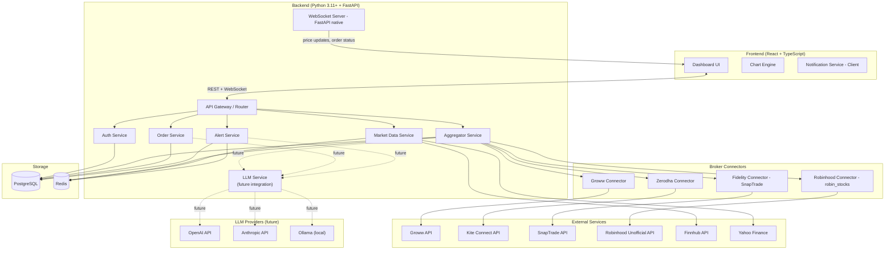

# Design Document: Stock Investment Dashboard

## Overview

The Stock Investment Dashboard is a full-stack web application that aggregates holdings from four brokers — Groww, Fidelity, Zerodha, and Robinhood — into a single unified view. It provides real-time portfolio valuation, interactive charts, buy/sell order placement, cross-broker analytics, and price alerts.

### Technology Stack

| Layer | Choice | Rationale |
|---|---|---|
| Frontend | React 18 + TypeScript + Vite | Modern, type-safe SPA with fast HMR; shadcn/ui for accessible components |
| State Management | TanStack Query v5 + Zustand | Server state (TanStack Query) and client/UI state (Zustand) separation |
| Charts | Recharts | Composable, accessible React chart library; no canvas lock-in |
| Backend | Python 3.11+ + FastAPI | Async-first framework with native type hints, auto-generated OpenAPI docs, and native WebSocket support; enables first-class Robinhood connector without a sidecar |
| Async HTTP | httpx (async) | Async HTTP client for broker API calls; replaces axios |
| Real-time | FastAPI native WebSocket | Built-in WebSocket support; no Socket.IO dependency needed |
| ORM | SQLAlchemy 2.0 (async) + Alembic | Async ORM with full migration support |
| Database | PostgreSQL | Relational integrity for users, tokens, orders, alerts |
| Cache | Redis (redis-py async) | Price cache, session store, rate-limit counters |
| Auth | JWT (python-jose) + bcrypt (passlib) + TOTP (pyotp) | Stateless sessions with MFA support |
| Encryption | Python `cryptography` (AES-256-GCM) | Token encryption at rest |
| LLM Abstraction | LangChain (Python) | Provider-agnostic LLM interface supporting OpenAI, Anthropic, Ollama, and others *(future integration)* |

### Market Data Provider

**Primary: Finnhub** ([finnhub.io](https://finnhub.io)) — free tier provides real-time US stock quotes via REST and WebSocket, plus global coverage. Supports 60 API calls/minute on the free plan.

**Fallback: yfinance-compatible Yahoo Finance endpoints** — used for historical data (1d, 1w, 1m, 3m, 1y, 5y ranges) where Finnhub free tier is insufficient.

### Broker API Strategy

| Broker | API | Auth Method | Notes |
|---|---|---|---|
| Groww | Official Groww Trading API (`api.groww.in/v1`) | API Key + TOTP | REST; supports holdings, orders, live quotes |
| Zerodha | Kite Connect v3 (`api.kite.trade`) | OAuth 2.0 (request_token → access_token) | Paid subscription (~₹2000/month); full REST + WebSocket |
| Fidelity | SnapTrade aggregator API | OAuth 2.0 via SnapTrade | Fidelity has no public retail API; SnapTrade provides a compliant OAuth bridge |
| Robinhood | Unofficial API via `robin_stocks` Python library | Username + password + MFA (TOTP) | No official public API; unofficial endpoints; risk of breakage. Now a first-class connector in the main FastAPI app — no sidecar needed. |

> **Robinhood note**: Because Robinhood has no official API, the connector uses the `robin_stocks` library. Since the entire backend is now Python, `robin_stocks` runs directly in the FastAPI process as a first-class connector — the previous Python sidecar is no longer needed. The connector remains isolated behind the `IBrokerConnector` interface so it can be replaced without affecting other components.

---

## Architecture

The system follows a layered architecture with a clear separation between the frontend SPA, a Python/FastAPI backend, and external broker/market-data services. A dedicated LLM Service layer is included as a first-class architectural citizen, designed for future integration.



> Dashed lines (` -.-> `) indicate planned future integrations that are not active in the initial release.

### Key Architectural Decisions

1. **Python-first backend**: The entire backend is Python 3.11+ with FastAPI. This eliminates the previous Node.js/TypeScript backend and the Python Robinhood sidecar — `robin_stocks` now runs directly in the FastAPI process as a first-class connector.

2. **Connector abstraction**: All broker connectors implement a common `IBrokerConnector` abstract base class. The Aggregator only knows about this interface, making it trivial to add or replace connectors.

3. **Price caching in Redis**: Market prices are cached in Redis with a 30-second TTL during market hours. This prevents hammering Finnhub's rate limits when multiple users hold the same stock.

4. **FastAPI native WebSocket**: FastAPI's built-in WebSocket support replaces Socket.IO. The backend pushes price ticks and order status changes to connected clients. The backend polls Finnhub every 30 seconds and fans out updates to subscribed clients.

5. **Robinhood connector merged into main backend**: Since the backend is now Python, `robin_stocks` runs in-process. The connector is still isolated behind `IBrokerConnector` so it can be swapped without affecting other components.

6. **SnapTrade for Fidelity**: SnapTrade is a regulated aggregator that provides OAuth-based access to Fidelity (and 50+ other brokers). This avoids screen-scraping and provides a stable, compliant integration path.

7. **LLM Service as future-ready layer**: A `LLMService` class implementing `ILLMService` is scaffolded in the backend from day one. It uses LangChain as the provider-agnostic abstraction layer. The service is wired into the dependency injection graph but returns stub responses until a provider is configured. This makes future LLM integration a configuration change rather than an architectural change.

---

## Components and Interfaces

All backend interfaces are defined as Python abstract base classes (ABCs). FastAPI's dependency injection system wires concrete implementations at startup.

### IBrokerConnector Abstract Base Class

Every broker connector implements this Python ABC:

```python
from abc import ABC, abstractmethod
from typing import Literal
from uuid import UUID

BrokerId = Literal["groww", "zerodha", "fidelity", "robinhood"]

class IBrokerConnector(ABC):
    broker_id: BrokerId

    # Auth lifecycle
    @abstractmethod
    async def get_authorization_url(self, user_id: UUID) -> str: ...

    @abstractmethod
    async def exchange_code_for_tokens(self, user_id: UUID, code: str) -> None: ...

    @abstractmethod
    async def refresh_tokens(self, user_id: UUID) -> None: ...

    @abstractmethod
    async def revoke_tokens(self, user_id: UUID) -> None: ...

    @abstractmethod
    async def is_connected(self, user_id: UUID) -> bool: ...

    # Data fetching
    @abstractmethod
    async def get_holdings(self, user_id: UUID) -> list[RawHolding]: ...

    @abstractmethod
    async def get_orders(self, user_id: UUID) -> list[RawOrder]: ...

    # Order placement
    @abstractmethod
    async def place_order(self, user_id: UUID, order: OrderRequest) -> OrderResult: ...

    @abstractmethod
    async def cancel_order(self, user_id: UUID, order_id: str) -> None: ...
```

### IAuthService

Manages dashboard-level authentication (not broker OAuth — that is handled per-connector):

```python
class IAuthService(ABC):
    @abstractmethod
    async def register(self, email: str, password: str) -> User: ...

    @abstractmethod
    async def login(self, email: str, password: str, totp_code: str | None = None) -> AuthTokens: ...

    @abstractmethod
    async def logout(self, user_id: UUID, session_id: UUID) -> None: ...

    @abstractmethod
    async def refresh_session(self, refresh_token: str) -> AuthTokens: ...

    @abstractmethod
    async def setup_mfa(self, user_id: UUID) -> MFASetupData: ...

    @abstractmethod
    async def verify_mfa(self, user_id: UUID, totp_code: str) -> bool: ...

    @abstractmethod
    async def get_session(self, access_token: str) -> Session: ...
```

### IAggregatorService

```python
class IAggregatorService(ABC):
    @abstractmethod
    async def get_portfolio(self, user_id: UUID) -> Portfolio: ...

    @abstractmethod
    async def get_holdings_by_broker(self, user_id: UUID, broker_id: BrokerId) -> list[NormalizedHolding]: ...

    @abstractmethod
    async def refresh_all(self, user_id: UUID) -> RefreshResult: ...
```

### IMarketDataService

```python
class IMarketDataService(ABC):
    @abstractmethod
    async def get_current_price(self, ticker: str) -> PriceQuote: ...

    @abstractmethod
    async def get_batch_prices(self, tickers: list[str]) -> dict[str, PriceQuote]: ...

    @abstractmethod
    async def get_historical_data(self, ticker: str, range: TimeRange) -> list[HistoricalDataPoint]: ...
```

### IOrderService

```python
class IOrderService(ABC):
    @abstractmethod
    async def place_order(self, user_id: UUID, request: OrderRequest) -> Order: ...

    @abstractmethod
    async def get_order_history(self, user_id: UUID, filters: OrderFilters | None = None) -> list[Order]: ...

    @abstractmethod
    async def get_order_status(self, user_id: UUID, order_id: UUID) -> Order: ...
```

### IAlertService

```python
class IAlertService(ABC):
    @abstractmethod
    async def create_alert(self, user_id: UUID, alert: CreateAlertRequest) -> Alert: ...

    @abstractmethod
    async def update_alert(self, user_id: UUID, alert_id: UUID, update: UpdateAlertRequest) -> Alert: ...

    @abstractmethod
    async def delete_alert(self, user_id: UUID, alert_id: UUID) -> None: ...

    @abstractmethod
    async def get_alerts(self, user_id: UUID) -> list[Alert]: ...

    @abstractmethod
    async def evaluate_alerts(self, ticker: str, current_price: float) -> list[TriggeredAlert]: ...
```

### ILLMService *(Future Integration)*

> **Note**: The LLM Service is a first-class architectural component designed for future integration. The `ILLMService` interface and a stub `LLMService` implementation are scaffolded from day one. The service returns placeholder responses until a provider (OpenAI, Anthropic, or Ollama) is configured via environment variables. No LLM calls are made in the initial release.

LangChain is used as the provider-agnostic abstraction layer, supporting OpenAI, Anthropic, Ollama, and any other LangChain-compatible provider.

```python
from abc import ABC, abstractmethod
from dataclasses import dataclass
from enum import Enum

class LLMProvider(str, Enum):
    OPENAI = "openai"
    ANTHROPIC = "anthropic"
    OLLAMA = "ollama"
    STUB = "stub"          # default — returns placeholder responses

@dataclass
class LLMAnalysisRequest:
    prompt: str
    context: dict          # structured data passed as context (e.g., portfolio snapshot)
    max_tokens: int = 512

@dataclass
class LLMAnalysisResponse:
    content: str
    provider: LLMProvider
    model: str
    is_stub: bool = False  # True when the stub implementation is active

class ILLMService(ABC):
    """
    Provider-agnostic LLM service interface.
    Backed by LangChain; the active provider is selected via the
    LLM_PROVIDER environment variable (default: stub).
    """

    @abstractmethod
    async def analyze_portfolio(
        self,
        user_id: UUID,
        portfolio: Portfolio,
    ) -> LLMAnalysisResponse:
        """
        Generate a natural-language summary and insight for a user's portfolio.
        Future use case: portfolio health analysis, concentration risk commentary.
        """
        ...

    @abstractmethod
    async def answer_natural_language_query(
        self,
        user_id: UUID,
        query: str,
        portfolio: Portfolio,
    ) -> LLMAnalysisResponse:
        """
        Answer a free-text question about the user's portfolio.
        Future use case: "Which of my stocks has the highest volatility this month?"
        """
        ...

    @abstractmethod
    async def generate_trade_recommendation(
        self,
        user_id: UUID,
        ticker: str,
        portfolio: Portfolio,
    ) -> LLMAnalysisResponse:
        """
        Generate a contextual trade recommendation for a given ticker.
        Future use case: rebalancing suggestions, risk-adjusted position sizing.
        NOTE: Recommendations are informational only and not financial advice.
        """
        ...

    @abstractmethod
    async def summarize_alerts(
        self,
        user_id: UUID,
        triggered_alerts: list[TriggeredAlert],
    ) -> LLMAnalysisResponse:
        """
        Produce a concise natural-language digest of triggered price alerts.
        Future use case: daily alert summary email / push notification.
        """
        ...
```

**Identified future LLM use cases:**

| Use Case | Method | Description |
|---|---|---|
| Portfolio analysis | `analyze_portfolio` | Natural-language commentary on portfolio health, concentration risk, sector exposure |
| Natural language queries | `answer_natural_language_query` | "Show me my worst performers this quarter" without navigating the UI |
| Trade recommendations | `generate_trade_recommendation` | Contextual, portfolio-aware suggestions (informational only, not financial advice) |
| Alert summarization | `summarize_alerts` | Digest multiple triggered alerts into a single readable summary |

**LangChain wiring (stub implementation):**

```python
# backend/services/llm_service.py
from langchain_core.language_models import BaseChatModel
from langchain_core.messages import HumanMessage, SystemMessage

class LLMService(ILLMService):
    """
    Concrete implementation backed by LangChain.
    Provider is selected at startup via LLM_PROVIDER env var.
    Defaults to StubLLM which returns placeholder responses.
    """

    def __init__(self, llm: BaseChatModel, provider: LLMProvider):
        self._llm = llm
        self._provider = provider
        self._is_stub = provider == LLMProvider.STUB

    async def analyze_portfolio(self, user_id: UUID, portfolio: Portfolio) -> LLMAnalysisResponse:
        if self._is_stub:
            return LLMAnalysisResponse(
                content="Portfolio analysis is not yet available.",
                provider=self._provider,
                model="stub",
                is_stub=True,
            )
        # Real implementation: build prompt, call self._llm, parse response
        ...

    # ... other methods follow the same stub/real pattern
```

**Provider selection at startup:**

```python
# backend/dependencies.py
import os
from langchain_openai import ChatOpenAI
from langchain_anthropic import ChatAnthropic
from langchain_ollama import ChatOllama

def create_llm_service() -> ILLMService:
    provider = LLMProvider(os.getenv("LLM_PROVIDER", "stub"))
    match provider:
        case LLMProvider.OPENAI:
            llm = ChatOpenAI(model=os.getenv("OPENAI_MODEL", "gpt-4o-mini"))
        case LLMProvider.ANTHROPIC:
            llm = ChatAnthropic(model=os.getenv("ANTHROPIC_MODEL", "claude-3-haiku-20240307"))
        case LLMProvider.OLLAMA:
            llm = ChatOllama(model=os.getenv("OLLAMA_MODEL", "llama3"))
        case _:
            llm = StubLLM()
    return LLMService(llm=llm, provider=provider)
```

### Frontend Components

```
src/
├── components/
│   ├── layout/
│   │   ├── DashboardLayout.tsx
│   │   ├── Sidebar.tsx
│   │   └── TopBar.tsx
│   ├── portfolio/
│   │   ├── PortfolioSummary.tsx      # Total value, gain/loss, day change
│   │   ├── HoldingsTable.tsx         # Sortable table of all holdings
│   │   ├── BrokerStatusBadge.tsx     # Connected/disconnected/error indicator
│   │   └── HoldingRow.tsx
│   ├── charts/
│   │   ├── AllocationChart.tsx       # Pie/donut chart
│   │   ├── PortfolioTrendChart.tsx   # Line chart over time
│   │   ├── PriceHistoryChart.tsx     # Per-stock price history
│   │   └── GainLossChart.tsx         # Bar chart gain/loss per stock
│   ├── orders/
│   │   ├── OrderForm.tsx             # Buy/sell form
│   │   ├── TransactionHistory.tsx
│   │   └── OrderStatusBadge.tsx
│   ├── alerts/
│   │   ├── AlertList.tsx
│   │   └── CreateAlertForm.tsx
│   ├── brokers/
│   │   ├── BrokerConnectionCard.tsx
│   │   └── BrokerComparisonTable.tsx
│   └── common/
│       ├── PriceChange.tsx           # Up/down indicator with animation
│       ├── TimeRangeSelector.tsx
│       └── StaleDataIndicator.tsx
├── hooks/
│   ├── usePortfolio.ts
│   ├── useMarketData.ts
│   ├── usePriceSocket.ts
│   └── useAlerts.ts
├── stores/
│   ├── uiStore.ts                    # Zustand: selected time range, active broker filter
│   └── socketStore.ts               # Zustand: WebSocket connection state
└── api/
    ├── portfolio.ts
    ├── orders.ts
    ├── alerts.ts
    └── brokers.ts
```

---

## Data Models

### Database Schema (PostgreSQL)

```sql
-- Users
CREATE TABLE users (
  id          UUID PRIMARY KEY DEFAULT gen_random_uuid(),
  email       TEXT UNIQUE NOT NULL,
  password_hash TEXT NOT NULL,
  mfa_secret  TEXT,                    -- encrypted TOTP secret
  mfa_enabled BOOLEAN DEFAULT FALSE,
  created_at  TIMESTAMPTZ DEFAULT NOW(),
  updated_at  TIMESTAMPTZ DEFAULT NOW()
);

-- Broker tokens (encrypted at rest)
CREATE TABLE broker_tokens (
  id              UUID PRIMARY KEY DEFAULT gen_random_uuid(),
  user_id         UUID NOT NULL REFERENCES users(id) ON DELETE CASCADE,
  broker_id       TEXT NOT NULL,       -- 'groww' | 'zerodha' | 'fidelity' | 'robinhood'
  access_token    TEXT NOT NULL,       -- AES-256-GCM encrypted
  refresh_token   TEXT,                -- AES-256-GCM encrypted
  token_iv        TEXT NOT NULL,       -- initialization vector for decryption
  token_tag       TEXT NOT NULL,       -- GCM auth tag
  expires_at      TIMESTAMPTZ,
  connected_at    TIMESTAMPTZ DEFAULT NOW(),
  last_refreshed  TIMESTAMPTZ,
  status          TEXT DEFAULT 'connected', -- 'connected' | 'disconnected' | 'error'
  UNIQUE(user_id, broker_id)
);

-- Holdings snapshot (refreshed on demand)
CREATE TABLE holdings_cache (
  id              UUID PRIMARY KEY DEFAULT gen_random_uuid(),
  user_id         UUID NOT NULL REFERENCES users(id) ON DELETE CASCADE,
  broker_id       TEXT NOT NULL,
  ticker          TEXT NOT NULL,
  company_name    TEXT,
  quantity        NUMERIC(18, 6) NOT NULL,
  avg_buy_price   NUMERIC(18, 6) NOT NULL,
  currency        TEXT DEFAULT 'USD',
  fetched_at      TIMESTAMPTZ DEFAULT NOW(),
  UNIQUE(user_id, broker_id, ticker)
);

-- Orders
CREATE TABLE orders (
  id              UUID PRIMARY KEY DEFAULT gen_random_uuid(),
  user_id         UUID NOT NULL REFERENCES users(id) ON DELETE CASCADE,
  broker_id       TEXT NOT NULL,
  broker_order_id TEXT,                -- ID returned by broker
  ticker          TEXT NOT NULL,
  order_type      TEXT NOT NULL,       -- 'market' | 'limit'
  side            TEXT NOT NULL,       -- 'buy' | 'sell'
  quantity        NUMERIC(18, 6) NOT NULL,
  limit_price     NUMERIC(18, 6),      -- NULL for market orders
  execution_price NUMERIC(18, 6),
  status          TEXT NOT NULL,       -- 'pending' | 'filled' | 'rejected' | 'cancelled'
  rejection_reason TEXT,
  placed_at       TIMESTAMPTZ DEFAULT NOW(),
  updated_at      TIMESTAMPTZ DEFAULT NOW()
);

-- Price alerts
CREATE TABLE alerts (
  id              UUID PRIMARY KEY DEFAULT gen_random_uuid(),
  user_id         UUID NOT NULL REFERENCES users(id) ON DELETE CASCADE,
  ticker          TEXT NOT NULL,
  target_price    NUMERIC(18, 6) NOT NULL,
  condition       TEXT NOT NULL,       -- 'above' | 'below'
  status          TEXT DEFAULT 'active', -- 'active' | 'triggered'
  triggered_at    TIMESTAMPTZ,
  created_at      TIMESTAMPTZ DEFAULT NOW(),
  updated_at      TIMESTAMPTZ DEFAULT NOW()
);

-- Sessions
CREATE TABLE sessions (
  id              UUID PRIMARY KEY DEFAULT gen_random_uuid(),
  user_id         UUID NOT NULL REFERENCES users(id) ON DELETE CASCADE,
  refresh_token_hash TEXT NOT NULL,
  expires_at      TIMESTAMPTZ NOT NULL,
  last_active     TIMESTAMPTZ DEFAULT NOW(),
  created_at      TIMESTAMPTZ DEFAULT NOW()
);
```

### Python Domain Models (Pydantic v2)

```python
from __future__ import annotations
from datetime import datetime
from decimal import Decimal
from typing import Literal
from uuid import UUID
from pydantic import BaseModel, Field

BrokerId = Literal["groww", "zerodha", "fidelity", "robinhood"]
TimeRange = Literal["1d", "1w", "1m", "3m", "1y", "5y"]

# Normalized holding (output of Aggregator)
class NormalizedHolding(BaseModel):
    ticker: str
    company_name: str
    broker_id: BrokerId
    quantity: Decimal
    avg_buy_price: Decimal
    current_price: Decimal
    current_value: Decimal
    gain_loss: Decimal
    gain_loss_percent: Decimal
    currency: str = "USD"
    last_updated: datetime

# Portfolio (aggregated across all brokers)
class Portfolio(BaseModel):
    user_id: UUID
    holdings: list[NormalizedHolding]
    total_value: Decimal
    total_invested: Decimal
    total_gain_loss: Decimal
    total_gain_loss_percent: Decimal
    day_change: Decimal
    day_change_percent: Decimal
    broker_statuses: list[BrokerStatus]
    last_refreshed: datetime

# Price quote from market data provider
class PriceQuote(BaseModel):
    ticker: str
    price: Decimal
    previous_close: Decimal
    change: Decimal
    change_percent: Decimal
    timestamp: datetime
    is_stale: bool = False

# Historical data point
class HistoricalDataPoint(BaseModel):
    date: datetime
    open: Decimal
    high: Decimal
    low: Decimal
    close: Decimal
    volume: int

# Order request
class OrderRequest(BaseModel):
    broker_id: BrokerId
    ticker: str
    side: Literal["buy", "sell"]
    order_type: Literal["market", "limit"]
    quantity: Decimal
    limit_price: Decimal | None = None

# Alert
class Alert(BaseModel):
    id: UUID
    user_id: UUID
    ticker: str
    target_price: Decimal
    condition: Literal["above", "below"]
    status: Literal["active", "triggered"] = "active"
    triggered_at: datetime | None = None
    created_at: datetime

# Broker connection status
class BrokerStatus(BaseModel):
    broker_id: BrokerId
    status: Literal["connected", "disconnected", "error"]
    last_successful_fetch: datetime | None = None
    error_message: str | None = None
```

### Redis Key Schema

```
# Price cache (TTL: 30s during market hours, 5min outside)
price:{ticker}  →  JSON PriceQuote

# Holdings cache (TTL: 5 minutes)
holdings:{userId}:{brokerId}  →  JSON NormalizedHolding[]

# Alert evaluation set (sorted by ticker for fast lookup)
alerts:active:{ticker}  →  SET of alertIds

# Session inactivity tracking (TTL: 30 minutes)
session:active:{sessionId}  →  timestamp

# Rate limit counters
ratelimit:finnhub:{minute}  →  integer count
```

---

## Correctness Properties

*A property is a characteristic or behavior that should hold true across all valid executions of a system — essentially, a formal statement about what the system should do. Properties serve as the bridge between human-readable specifications and machine-verifiable correctness guarantees.*

### Property 1: Holdings normalization preserves all required fields

*For any* raw holding returned by any broker connector (Groww, Zerodha, Fidelity, Robinhood), normalizing it to the common schema SHALL produce a `NormalizedHolding` where `ticker`, `companyName`, `quantity`, `avgBuyPrice`, `currentPrice`, `currentValue`, and `gainLossPercent` are all present, non-null, and where `quantity` and `avgBuyPrice` are numerically equal to the original raw values (no rounding or truncation during conversion).

**Validates: Requirements 2.2**

---

### Property 2: Portfolio summary math invariants

*For any* non-empty array of `NormalizedHolding` objects, the computed `Portfolio` summary SHALL satisfy all of the following simultaneously:
- `totalValue === sum(h.currentValue for h in holdings)`
- `totalInvested === sum(h.avgBuyPrice * h.quantity for h in holdings)`
- `totalGainLoss === totalValue - totalInvested`
- `totalGainLossPercent === (totalGainLoss / totalInvested) * 100` when `totalInvested > 0`

**Validates: Requirements 2.4**

---

### Property 3: Combined position aggregation is correct

*For any* set of holdings where the same ticker symbol appears at multiple brokers, the combined position displayed SHALL have a total quantity equal to the sum of individual quantities across all brokers, and a combined average cost basis equal to the quantity-weighted average of per-broker average buy prices.

**Validates: Requirements 2.3, 6.2**

---

### Property 4: Stale data indicator never shows a future timestamp

*For any* broker connector or market data source that has failed to fetch fresh data, given a `lastFetchedAt` timestamp and the current time `now`, the staleness duration computed SHALL be `>= 0` (never negative) and the displayed "last updated" time SHALL be `<= now` (never in the future).

**Validates: Requirements 2.5, 3.4**

---

### Property 5: Alert condition evaluation is consistent

*For any* numeric current price `P` and target price `T`, the alert evaluation function SHALL return `triggered = true` if and only if `P > T` when condition is `above`, and `triggered = true` if and only if `P < T` when condition is `below`. This must hold for all valid finite numeric values including boundary cases where `P === T`.

**Validates: Requirements 7.1, 7.2**

---

### Property 6: Triggered alert is not re-triggered without reset

*For any* alert that transitions to `triggered` status, all subsequent calls to `evaluateAlertCondition()` for that alert SHALL return `triggered = false` regardless of the current price, until the alert status is explicitly reset to `active`.

**Validates: Requirements 7.3**

---

### Property 7: Order history round-trip preserves all fields

*For any* `OrderRequest` submitted through the Order Service, retrieving the resulting order by its ID from the order history SHALL return a record with identical `brokerId`, `ticker`, `side`, `orderType`, `quantity`, and `limitPrice` values to those in the original request.

**Validates: Requirements 5.6**

---

### Property 8: Order notification contains all required fields

*For any* order that receives a status update from a broker (confirmed or rejected), the notification emitted by the Notification Service SHALL contain the `orderType`, `ticker`, `quantity`, and `executionPrice` for confirmed orders, and the `rejectionReason` for rejected orders. No required field may be absent or null.

**Validates: Requirements 5.4, 5.5**

---

### Property 9: Token encryption round-trip is lossless

*For any* OAuth token string (including strings with Unicode characters, special characters, and arbitrary length), encrypting it with AES-256-GCM and then decrypting it using the same key and stored IV/tag SHALL produce a string that is byte-for-byte identical to the original.

**Validates: Requirements 8.1**

---

### Property 10: Session expiry is determined solely by inactivity duration

*For any* session with a `lastActive` timestamp and a current time `now`, the session SHALL be considered expired if and only if `(now - lastActive) > 30 minutes`. This must hold for all valid timestamp pairs, including edge cases where the difference is exactly 30 minutes.

**Validates: Requirements 8.3**

---

### Property 11: Portfolio allocation percentages sum to 100

*For any* non-empty portfolio, the allocation percentages computed for the allocation chart (both by-stock and by-broker breakdowns) SHALL sum to 100% (within a floating-point tolerance of ±0.01%).

**Validates: Requirements 4.1**

---

### Property 12: Top/bottom performer ranking invariant

*For any* array of holdings with gain/loss percentages, the top-5 performers selected SHALL each have a gain/loss percentage greater than or equal to every holding not in the top-5, and the bottom-5 performers SHALL each have a gain/loss percentage less than or equal to every holding not in the bottom-5.

**Validates: Requirements 6.4**

---

## Error Handling

### Broker Connector Failures

Each connector wraps all external calls in a try/except. On failure:
- The error is logged with broker ID, user ID (hashed), and error type (not the raw token).
- The `broker_tokens` table `status` field is updated to `'error'`.
- The Aggregator returns the last cached holdings from `holdings_cache` with a `staleness` flag.
- The frontend `BrokerStatusBadge` shows the error state and the time of last successful fetch.

### Token Expiry and Refresh

- Before each broker API call, the connector checks `expires_at` in `broker_tokens`.
- If the token is within 5 minutes of expiry, a proactive refresh is attempted.
- If refresh fails (e.g., refresh token revoked), the connector marks the broker as `disconnected` and the user is prompted to re-authenticate.
- Token refresh is serialized per user+broker using a Redis lock to prevent concurrent refresh races.

### Market Data Failures

- If Finnhub returns an error or rate-limit response (429), the Market Data Service falls back to the last cached price in Redis.
- If the cache is also empty (cold start), the price is marked as unavailable and the frontend shows `N/A` with a staleness indicator.
- Historical data failures are surfaced as empty chart states with a retry button.

### Order Placement Failures

- Network errors during order submission are retried once with exponential backoff (500ms, then 1000ms) using `httpx`'s async retry support.
- If the broker rejects the order, the rejection reason from the broker response is stored in `orders.rejection_reason` and surfaced in the notification.
- Idempotency: before placing an order, the backend checks for a duplicate pending order (same user, broker, ticker, side, quantity within the last 10 seconds) to prevent double-submission.

### Session Expiry

- JWT access tokens expire after 15 minutes; refresh tokens after 7 days.
- A Redis key `session:active:{sessionId}` is updated on every authenticated request. If the key has expired (30 minutes of inactivity), the session is invalidated even if the JWT is still technically valid.
- On session expiry, the frontend receives a 401 response, clears in-memory state, and redirects to the login page.

### WebSocket Disconnection

- The frontend WebSocket client uses automatic reconnection with exponential backoff (max 30 seconds).
- While disconnected, the frontend shows a "Reconnecting..." banner and falls back to polling the REST API every 60 seconds.
- On reconnection, the client re-subscribes to all tickers in the current portfolio.

### LLM Service Failures *(Future)*

- If the configured LLM provider is unavailable or returns an error, the LLM Service catches the exception and returns a graceful fallback response (e.g., "Analysis is temporarily unavailable.").
- LLM errors are logged but never surfaced as hard failures — the dashboard remains fully functional without LLM features.
- The stub implementation (default) never raises exceptions.

---

## Testing Strategy

### Unit Tests (pytest)

Unit tests cover pure business logic in isolation using `pytest` with `pytest-asyncio` for async test functions:

- **Aggregator normalization**: Test that `normalize_holding()` correctly maps each broker's raw schema to `NormalizedHolding`. One test per broker.
- **Portfolio calculations**: Test `compute_portfolio_summary()` with known holdings to verify total value, gain/loss, and percentage calculations.
- **Alert evaluation**: Test `evaluate_alert_condition()` with boundary values (price exactly at target, just above, just below).
- **Token encryption**: Test the AES-256-GCM encrypt/decrypt round-trip.
- **Order deduplication**: Test that the idempotency check correctly identifies duplicate orders within the time window.
- **LLM stub**: Test that the stub `LLMService` returns `is_stub=True` and never raises exceptions regardless of input.

### Property-Based Tests (pytest + hypothesis)

Property-based tests use [Hypothesis](https://hypothesis.readthedocs.io) to verify universal properties across randomly generated inputs. Each test is decorated with `@settings(max_examples=100)` (minimum).

**Feature: stock-investment-dashboard, Property 1: Holdings normalization preserves all required fields**
```python
@given(raw_holding=st.builds(RawHolding, ...))  # one strategy per broker schema
@settings(max_examples=100)
def test_normalization_preserves_fields(raw_holding):
    result = normalize_holding(raw_holding)
    assert result.ticker and result.company_name
    assert result.quantity == raw_holding.quantity
    assert result.avg_buy_price == raw_holding.avg_buy_price
```

**Feature: stock-investment-dashboard, Property 2: Portfolio summary math invariants**
- Generate arbitrary lists of `NormalizedHolding` with random prices and quantities using `st.lists(st.builds(NormalizedHolding, ...))`.
- Assert all four math invariants hold simultaneously.

**Feature: stock-investment-dashboard, Property 3: Combined position aggregation is correct**
- Generate arbitrary sets of per-broker holdings for the same ticker across multiple brokers.
- Assert combined quantity equals sum of individual quantities.
- Assert combined average cost basis equals quantity-weighted average.

**Feature: stock-investment-dashboard, Property 4: Stale data indicator never shows a future timestamp**
- Generate arbitrary `last_fetched_at` timestamps and current times using `st.datetimes()`.
- Assert staleness duration is always >= 0 and displayed timestamp is always <= now.

**Feature: stock-investment-dashboard, Property 5: Alert condition evaluation is consistent**
- Generate arbitrary `(price, target_price, condition)` triples using `st.decimals()` and `st.sampled_from(["above", "below"])`.
- Assert `should_trigger(price, target_price, "above") == (price > target_price)` and `should_trigger(price, target_price, "below") == (price < target_price)`.

**Feature: stock-investment-dashboard, Property 6: Triggered alert is not re-triggered without reset**
- Generate an alert and a sequence of arbitrary price updates using `st.lists(st.decimals())`.
- Assert that after the first trigger, no subsequent price evaluation produces a trigger until the alert is explicitly reset.

**Feature: stock-investment-dashboard, Property 7: Order history round-trip preserves all fields**
- Generate arbitrary `OrderRequest` objects using `st.builds(OrderRequest, ...)`.
- Persist them via the Order Service (with a mock async DB session) and retrieve by ID.
- Assert all fields are identical.

**Feature: stock-investment-dashboard, Property 8: Order notification contains all required fields**
- Generate arbitrary confirmed and rejected order objects.
- Trigger the notification formatter.
- Assert confirmed notifications contain `order_type`, `ticker`, `quantity`, `execution_price`; rejected notifications contain `rejection_reason`.

**Feature: stock-investment-dashboard, Property 9: Token encryption round-trip is lossless**
- Generate arbitrary token strings using `st.text()` (including Unicode, special characters, empty strings, very long strings).
- Assert `decrypt(encrypt(token)) == token` byte-for-byte.

**Feature: stock-investment-dashboard, Property 10: Session expiry is determined solely by inactivity duration**
- Generate arbitrary `(last_active, now)` datetime pairs using `st.datetimes()`.
- Assert `is_expired(last_active, now) == ((now - last_active) > timedelta(minutes=30))`.

**Feature: stock-investment-dashboard, Property 11: Portfolio allocation percentages sum to 100**
- Generate arbitrary non-empty holdings lists with random values using `st.lists(..., min_size=1)`.
- Compute allocation percentages (by stock and by broker).
- Assert each set of percentages sums to 100 within ±0.01% tolerance.

**Feature: stock-investment-dashboard, Property 12: Top/bottom performer ranking invariant**
- Generate arbitrary lists of holdings with random gain/loss percentages using `st.lists(st.decimals(), min_size=1)`.
- Assert top-N performers each have gain/loss % >= all non-top-N holdings.
- Assert bottom-N performers each have gain/loss % <= all non-bottom-N holdings.

### Integration Tests (pytest + pytest-asyncio + testcontainers-python)

Integration tests run against real PostgreSQL and Redis instances spun up via `testcontainers-python`:

- **Auth flow**: Register → login → refresh → logout cycle.
- **Broker connection**: Mock broker OAuth callback → token storage → token retrieval.
- **Holdings aggregation**: Mock connector responses → aggregated portfolio shape.
- **Order placement**: Mock broker order API → order persisted in DB → status update via WebSocket.
- **Alert triggering**: Create alert → simulate price update → verify notification emitted.

### End-to-End Tests (Playwright)

E2E tests cover critical user journeys in a browser:

- Connect a broker account (mocked OAuth flow).
- View portfolio summary and holdings table.
- Place a buy order and see confirmation notification.
- Create a price alert and verify it appears in the alert list.
- Verify responsive layout at 375px (mobile) and 1440px (desktop).

### Accessibility Testing

- Automated: `axe-core` integrated into Playwright tests to catch WCAG 2.1 AA violations.
- Manual: Keyboard navigation walkthrough and screen reader (NVDA/VoiceOver) spot-checks for the holdings table and order form.

### Performance Testing

- Lighthouse CI run on each PR to enforce the 3-second initial load budget (Requirement 9.5).
- Load test with k6: simulate 50 concurrent users refreshing portfolios to verify the 5-second aggregation SLA (Requirement 2.1).
